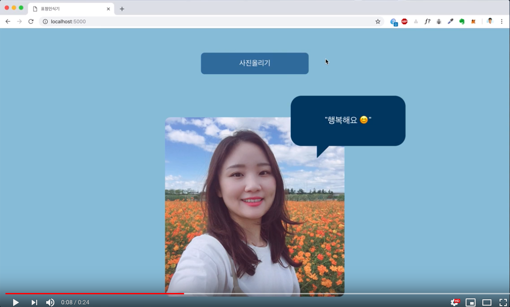

# 소개
구글에서 진행하는 '구글 클라우드 해커톤'에서 '링크드'팀의 얼굴 및 표정인식 웹서비스를 도커 이미지로 만든 뒤,
GCP Kubernetes에 배포 운영.

## 얼굴인식
1. opencv를 이용한 간단한 얼굴인식 (basic_opencv.py)
2. HOC와 Landmark를 이용한 얼굴인식 (basic_hoc_with_landmark.py)

#### HOC와 Landmark를 이용한 얼굴인식 튜토리얼
1. 얼굴을 인식하는데, 색상 데이터는 크게 중요하지 않음.
    색상 image shape (width, height, 3)의 3은 BGR데이터를 의미하며,
    불필요한 데이터는 연산 속도를 낮추므로, (width, height, 1)로 흑백 이미지로 변환한다.
2. HOC(Histogram of Oriented Gradients)를 이용하여 얼굴을 찾는다.
    HOC는 각 픽셀에 대하여 이를 둘러싸고 있는 픽셀들과 비교하여, 어두운 방향을 나타내는 화살표를 나타내는 방식이고,
    이 화살표를 그래디언트(gradient)라 한다.
     
    이러한 프로세스를 통해 전체 이미지에서 밝은 부분으로부터 어두운 부분으로의 흐름을 알 수 있다.
    아래 이미지의 왼쪽 패턴은 여러 이미지를 학습시켜 도출된 패턴이며, 오른쪽 패턴은 하나의 이미지에서 HOC를 적용한 아웃풋이다. 
     
    이러한 절차는 dlib이라는 library를 이용하여 해결할수 있다.
3. Landmark를 통하여 얼굴인식 성능 높이기
    사진에서 얼굴이 항상 정면을 바라보진 않기때문에, 측면을 보거나, 명암 등의 조건을 고려했을때
    동일한 얼굴로 판단하기 위해서, 얼굴에 존재하는 68개의 랜드마크를 이용하여 눈,코,입을 이미지 상에서 대략 동일한 위치에 맞출수 있음. 
     
    이러한 절차는 openface 라이브러리의 shape_predictor_68_face_landmarks를 통해 해결수 있다.
    (이 방법은 여러 각도의 사진에서 해당 사람이 같은 사람인지 판별할때 보다 적합함.)
4. 일련의 절차  
    
    
     
    Input Image => HOC를 통해 얼굴을 찾은뒤, Landmark를 통해 얼굴의 특징을 찾기 => 찾은 얼굴의 특징을 통해 얼굴을 평면으로 늘리기.

## 캐글 데이터를 이용한 표정 학습
데이터 셋은 이미지 사이즈가 48*48로 되어 있고, 결과 값은 7가지 표정이므로(0=Angry, 1=Disgust, 2=Fear, 3=Happy, 4=Sad, 5=Surprise, 6=Neutral)
softmax를 이용하여 나오는 출력 뉴런의 수는 7이다.
데이터 셋은 28,709개의 학습 데이터와 3,589의 테스트 데이터로 되어있다.

표정인식은 CNN을 이용하여 학습시켰고, 주피터 노트북으로 모델을 summary한 결과는 아래 링크와 같다.
[model summary](data/modelSummary.md) 

Keras에서 만든 모델을 저장할 때는 다음과 같은 룰을 따릅니다.
모델은 JSON 파일 또는 YAML 파일로 저장한다. 
Weight는 H5 파일로 저장한다.
서비스를 이용할땐, model.json 파일과, 학습된 가중치 파일 weight.h5을 이용하면 된다.

## Web Server
Flask를 이용하여 간단한 웹서버 띄우기.
Spring 프레임워크에서 annotation을 사용하는것과 같이 decorator를 이용하여 웹 경로를 지정할수 있음.
실행은 'python3 파일명' 을 통해 실행할수 있다.   
1. simpleServer.py
Test 이미지를 HOC와 landmark를 이용하여 도출된 얼굴인식 이미지를 이용.
2. simpleServer2.py
Test 이미지를 opencv를 이용하여 도출된 얼굴인식 이미지를 이용. 
##### 결과
캐글에서 가져온 데이터가 전처리가 필요하지 않아, landmark를 이용하여 얼굴을 늘리는 작업을 이용하지 않았음.
별다른 전처리를 하지 않은 이미지로 학습 시킨 model을, 테스트할때 landmark를 이용하여 얼굴을 평면으로 늘린 이미지를 이용할 경우
정확도가 다르게 나올수 있음. 그러므로, 현재 result 디렉토리에 있는 model에는 simpleServer2 서버가 보다 정확성이 높음.  

## 보다 나은 성능을 내려면?
1. 학습 데이터도 landmark를 통해 얼굴을 평면으로 만든뒤, 학습시키고 simpleServer1를 이용하면 보다 좋은 성능을 낼수 있을듯 싶다.
2. 노트북으로 데이터를 학습 시키다보니, 20epoch을 돌리는데 5~6시간의 시간이 들었음. 
    보다 높은 사양의 컴퓨터로, 복잡한 컨볼루션 레이션을 충분히 돌린다면 훨씬 높은 학습률을 기대할수 있을것 같음.
    그렇다면???
    구글 클라우드에 있는 Google ML을 이용하여, 학습을 시킨다면 매우 빠르게 결과를 도출 낼수 있을것이다.
    GCP 라이센스가 조금 남아 있으니, 다음에 도전해보자! 

## 시연 영상

## Hackerton 
  
해커톤 대회 3일전부터 개발 시작하여 회사 퇴근후, 밤마다 작업의 흔적.  
  
해커톤에서 발표하고 있는 저의 모습(그룹장 서진혁).  
  
그렇게 '링크드'팀은 전체 18개 팀중 2등을 하였습니다.  

  
밤마다 작업하여, 마감 전까지 불태워 짧지만 빡새게 한 만큼 보람이 있었던 해커톤.

## pip3로 설치되지 않는 의존성 설치 (dlib, openface)
1. dlib 
https://medium.com/@210/install-dlib-on-mac-ff9f4d03ad8
2. openface
https://cmusatyalab.github.io/openface/setup/#setup

## 데이터셋
https://www.kaggle.com/c/challenges-in-representation-learning-facial-expression-recognition-challenge/data

## 참조
1. opencv를 이용한 얼굴인식 (basic_opencv.py)
https://pinkwink.kr/1124 
2. HOC와 랜드마크를 이용한 얼굴인식 (basic_hoc_with_landmark.py)
https://medium.com/@jongdae.lim/%EA%B8%B0%EA%B3%84-%ED%95%99%EC%8A%B5-machine-learning-%EC%9D%80-%EC%A6%90%EA%B2%81%EB%8B%A4-part-4-63ed781eee3c
